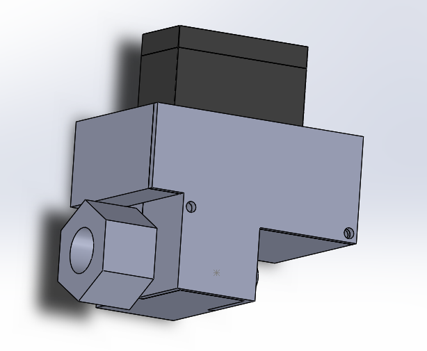

# MG995 Servo & Ball Valve Bracket

A custom-designed 3D printable bracket to securely mount an MG995 servo motor and a standard 1/4" ball valve compressor, enabling remote or automated control in fluid handling and plumbing systems.

## 🛠️ Project Description

This bracket is made to align and hold an MG995 servo motor in tandem with a manually actuated ball valve, converting rotational servo motion into valve actuation. Ideal for fluid automation, DIY irrigation systems, or home engineering projects where manual valve control needs to be automated.

## 🎯 Purpose of the Bracket

- Provide a robust mount for MG995 servo and 1/4" ball valve compressor
- Enable automated or remote control of fluid flow
- Eliminate the need for expensive solenoid or motorized valves
- Simplify mechanical integration in small-scale automation systems

## ✅ Compatibility
- **Servo:** MG995 (standard size servo motor)
- **Ball Valve Compressor:** 1/4" manual ball valves with lever handle (modification may be required for different sizes or handle designs)

---

---

## 📄 License

Licensed under the **MIT License** — free to use, modify, and distribute.  
Attribution appreciated but not required.

---
